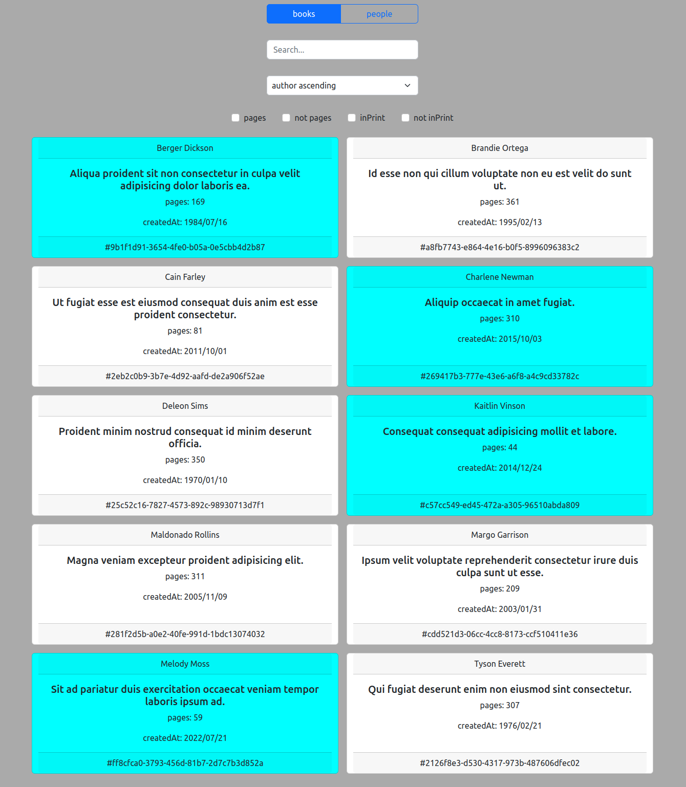

   

Based on udemy courses:

- 'Advanced TypeScript: Generic Search, Sorting, and Filtering' by Chris Frewin
- 'Build Polymorphic Components with React and Typescript' by Ohans Emmanuel

Dummy data: https://json-generator.com

